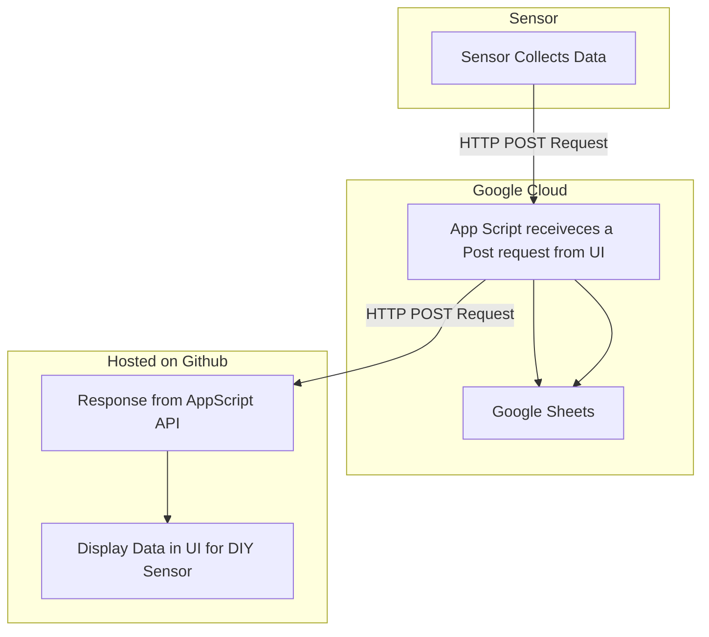

# DIY Sensor Architechture

DIY Sensor Data Pipeline

```mermaid
  flowchart TD
    subgraph Sensor
        A1[Sensor Collects Data]
    end

    subgraph Google Cloud
        B1[App Script receiveces a Post request from micro-controller] --> B2[Google Sheets]
        B1[App Script receiveces a Post request from UI] --> B2[Google Sheets]
    end

    subgraph Hosted on Github
        C1[Response from AppScript API] --> C2[Display Data in UI for DIY Sensor]
    end

    A1 --> |HTTP POST Request|B1
    B1 --> |HTTP POST Request|C1

```

