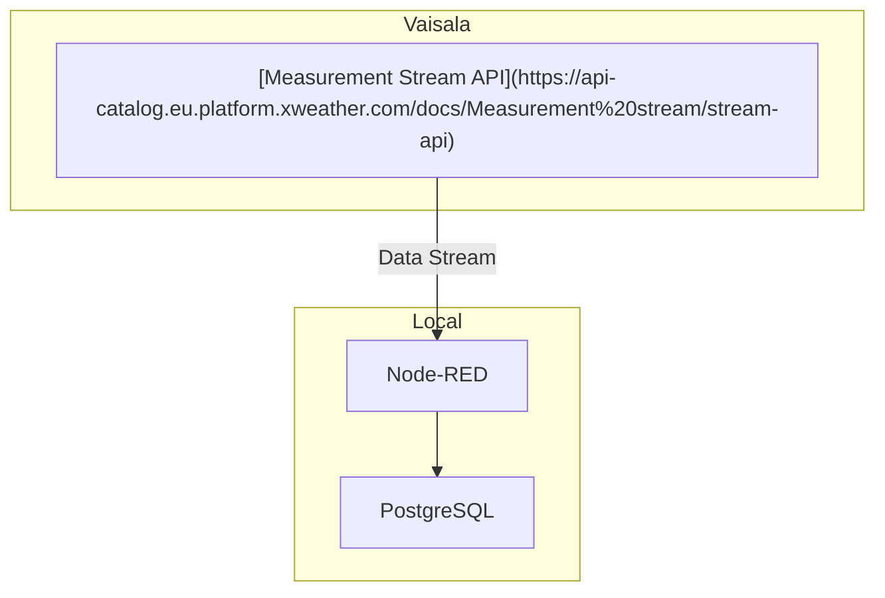

# Streaming sensor data into PostgreSQL

## Vaisala Stream API

```mermaid
  flowchart TD
    subgraph Vaisala
        A1["[Measurement Stream API](https://api-catalog.eu.platform.xweather.com/docs/Measurement%20stream/stream-api)"]
    end

    subgraph Local
        B1[Node-RED] --> B2[PostgreSQL]
    end

    A1 -->|Data Stream| B1


```

## AppScript Stream

```mermaid

```
```

