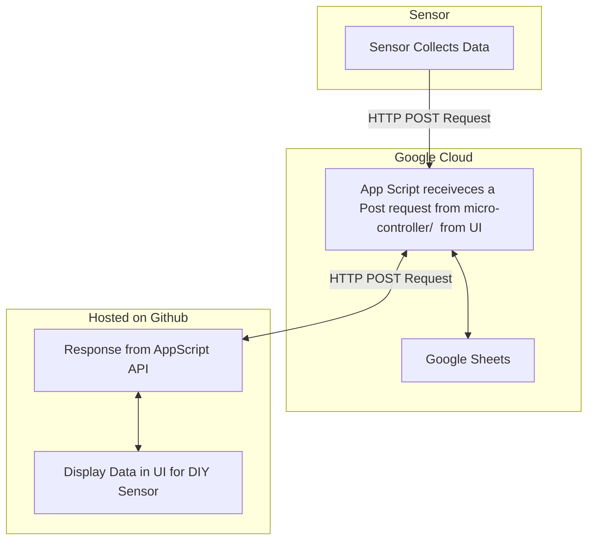

# DIY Sensor 

Hi! 

Welcome to one of my projects. This project uses a DHT11 temperature and humidity sensor, an Adafruit M0 feather with a WIFI chip to send and receive information from a mini api server running on AppScript. 

### Architechture

Components you will need:
 - Adafruit M0 feather micro controller with WiFi shield 
 - DHT11 Keys Temperature and Humidity Sensor
 - Optional [LM35](https://www.keyestudio.com/products/free-shippingkeyestudio-lm35-linear-temperature-sensor-module-for-arduino), [18820](https://wiki.keyestudio.com/Ks0023_keyestudio_18B20_Temperature_Sensor) temperature sensors.

Reference: 
 - [Google Sheets API](https://developers.google.com/workspace/sheets/api/guides/concepts)
 - [Google AppScript API](https://developers.google.com/apps-script/api/reference/rest)
 - [Mozilla HTTP](https://developer.mozilla.org/en-US/docs/Web/HTTP)
