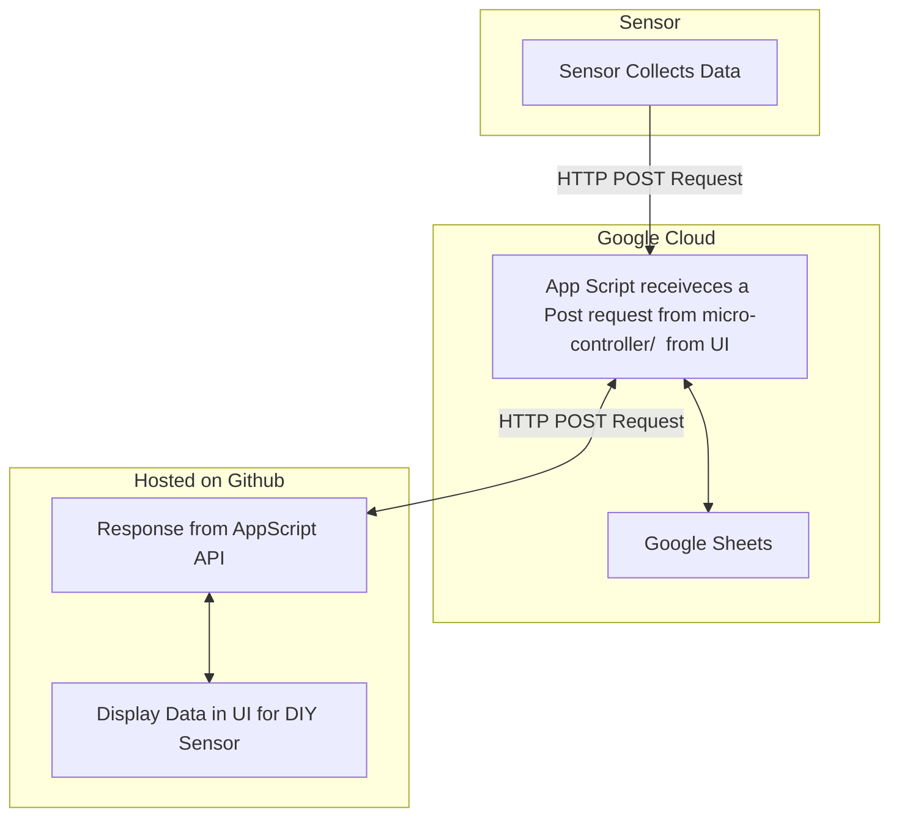

# DIY Sensor Architechture

Components you will need:
 - Adafruit M0 feather micro controller with WiFi shield 
 - DHT11 Keys Temperature and Humidity Sensor

Reference: 
 - [Google Sheets API](https://developers.google.com/workspace/sheets/api/guides/concepts)
 - [Google AppScript API](https://developers.google.com/apps-script/api/reference/rest)
 - [Mozilla HTTP](https://developer.mozilla.org/en-US/docs/Web/HTTP)
