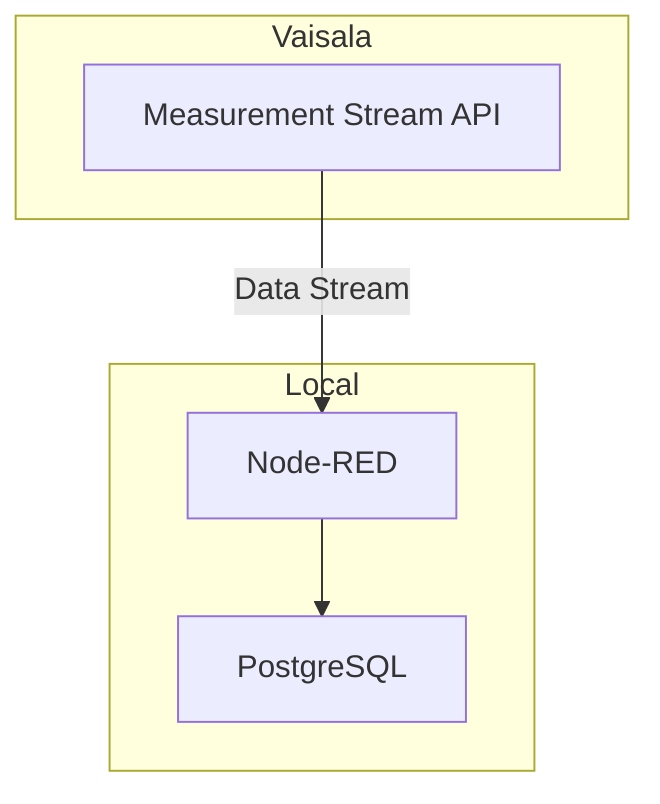
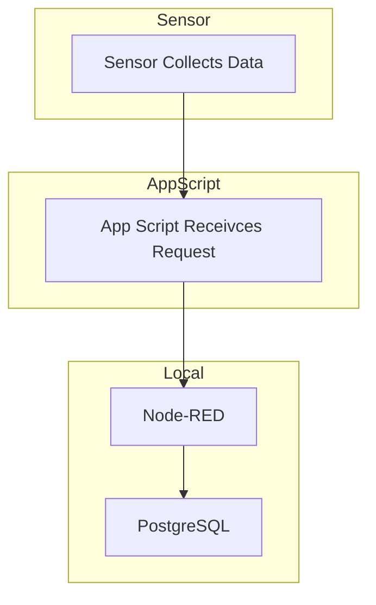

# Streaming sensor data into PostgreSQL

## Vaisala Stream API

## AppScript Stream

### References:
  + [Meassurement Stream API](https://api-catalog.eu.platform.xweather.com/docs/Measurement%20stream/stream-api)

