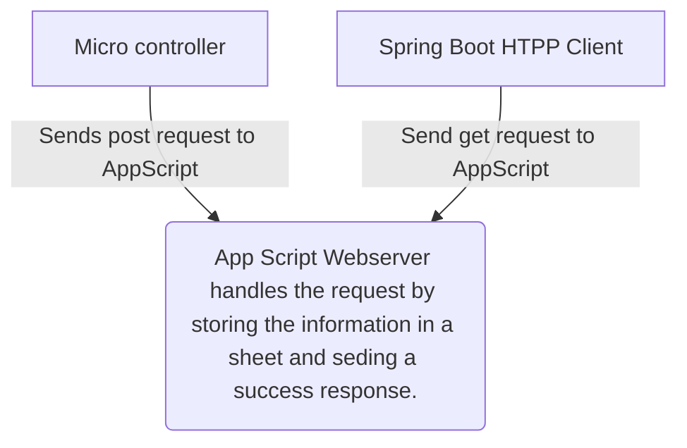
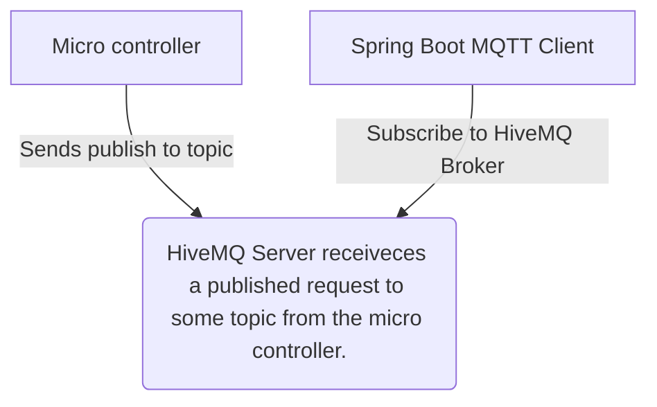

# DIY Sensor

Components you will need:
 - ESP32 
 - DHT11 Keys Temperature and Humidity Sensor
 - Services AppScript or HiveMQ

Wiring:


### Architechture HTTP


```mermaid
  flowchart TD
    A[Micro controller] -->|Sends post request to AppScript| B(App Script Webserver handles the request by storing the information in a sheet and seding a success response.)

    C[Spring Boot HTPP Client] -->|Send get request to AppScript|B
  
```
### HTTP Client Code
```

```

### HTTP Sensor Code:
```


```

### Architechture MQTT


```mermaid
   flowchart TD
    A[Micro controller] -->|Sends publish to topic| B(HiveMQ Server receiveces a published request to some topic from the micro controller.)
    C[Spring Boot MQTT Client] -->|Subscribe to HiveMQ Broker|B
```
### MQTT Client Code
```
```


### MQTT Sensor Code:
```


```
   
Reference: 
 - [HiveMQ Guide](https://docs.hivemq.com/hivemq/latest/user-guide/index.html)


