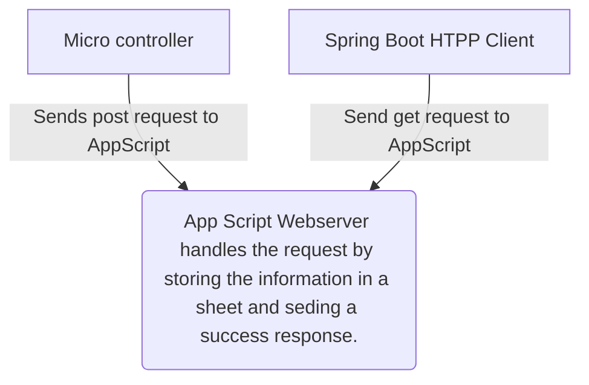
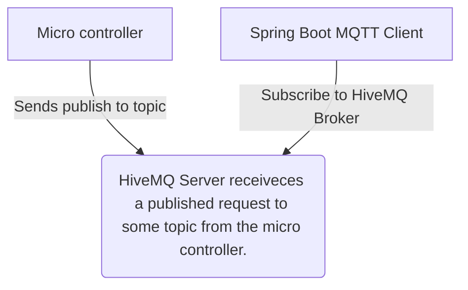

# DIY Sensor

Components you will need:
 - ESP32 
 - DHT11 Keys Temperature and Humidity Sensor
 - Services AppScript or HiveMQ

Wiring:

### Architechture HTTP

```mermaid
  flowchart TD
    A[Micro controller] -->|Sends post request to AppScript| B(App Script Webserver handles the request by storing the information in a sheet and seding a success response.)

    C[Spring Boot HTPP Client] -->|Send get request to AppScript|B
  
```

### Architechture MQTT

```mermaid
   flowchart TD
    A[Micro controller] -->|Sends publish to topic| B(HiveMQ Server receiveces a published request to some topic from the micro controller.)
    C[Spring Boot MQTT Client] -->|Subscribe to HiveMQ Broker|B
```
   
Reference: 
 - [AppScrip Documentation](https://developers.google.com/apps-script/guides/sheets)
 - [What is a server? Mozzilla](https://developer.mozilla.org/en-US/docs/Learn_web_development/Howto/Web_mechanics/What_is_a_web_server)
 - [HiveMQ Guide What is a broker? What is MQTT?](https://docs.hivemq.com/hivemq/latest/user-guide/index.html)
 - [Better Log](https://github.com/peterherrmann/BetterLog)

