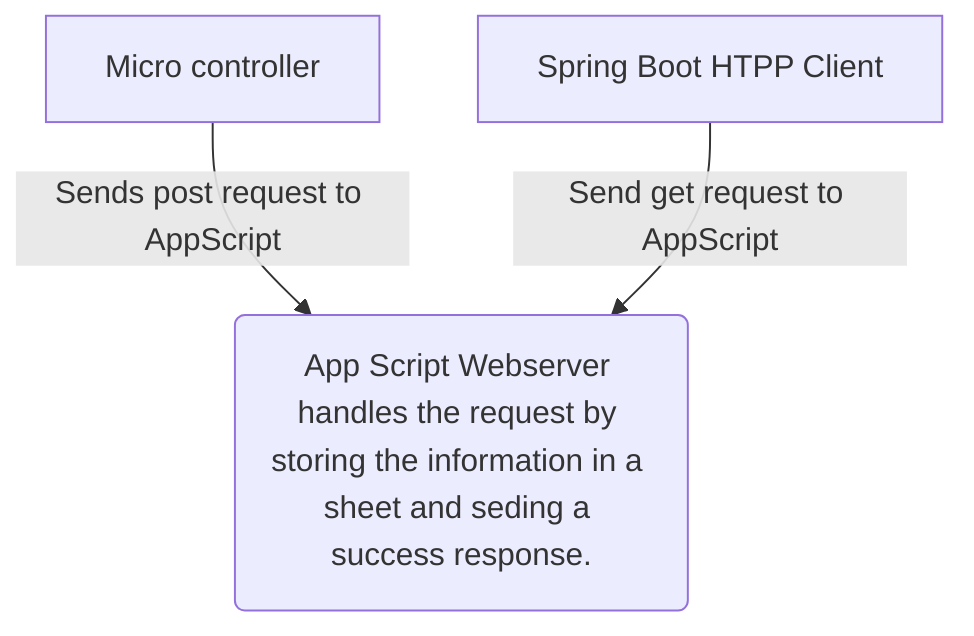
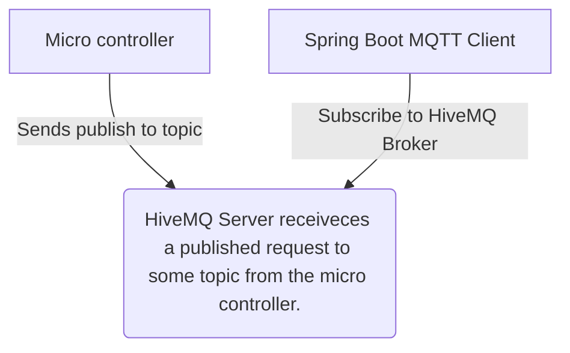

# DIY Sensor

Components you will need:
 - ESP32 
 - DHT11 Keys Temperature and Humidity Sensor
 - Services AppScript or HiveMQ

Wiring:


### Architechture HTTP


```mermaid
  flowchart TD
    A[Micro controller] -->|Sends post request to AppScript| B(App Script Webserver handles the request by storing the information in a sheet and seding a success response.)

    C[Spring Boot HTPP Client] -->|Send get request to AppScript|B
  
```
### HTTP Client Code
For this project I used AppScript as it can be used as a free public web server and google sheets as our database. 

One important thing to note is that the response from the web server is a content service object that requires the client to perform a redirect in order to see the returned content. 

```
// The server.js contains the code for the web server to work as an api.


```

### HTTP Sensor Code:
For the ESP32 we have to flash the Certificate of Authority(CA) to the board. The CA can be optained using openssl.


```
//

```

### Architechture MQTT


```mermaid
   flowchart TD
    A[Micro controller] -->|Sends publish to topic| B(HiveMQ Server receiveces a published request to some topic from the micro controller.)
    C[Spring Boot MQTT Client] -->|Subscribe to HiveMQ Broker|B
```
### MQTT Client Code
For the ESP32 we have to flash the Certificate of Authority(CA) to the board. The CA can be optained using openssl.

```
```


### MQTT Sensor Code:
```


```
   
Reference: 
 - [HiveMQ Guide](https://docs.hivemq.com/hivemq/latest/user-guide/index.html)


