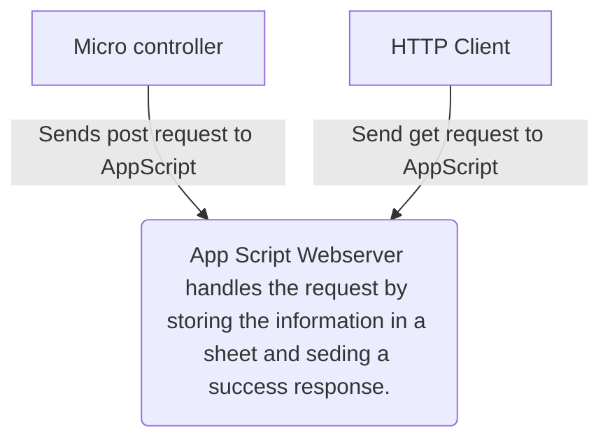

# DIY Sensor

Components you will need:
 - Micro-controller  ESP32 
 - Sensor            DHT11 Keys Temperature and Humidity Sensor
 - Services          AppScript

### Architechture HTTP

```mermaid
  flowchart TD
    A[Micro controller] -->|Sends post request to AppScript| B(App Script Webserver handles the request by storing the information in a sheet and seding a success response.)

    C[HTTP Client] -->|Send get request to AppScript|B
  
```

### Walkthrough

### Updates
2/24/2026 - Adding C to F button. Adding black and white mode. 

