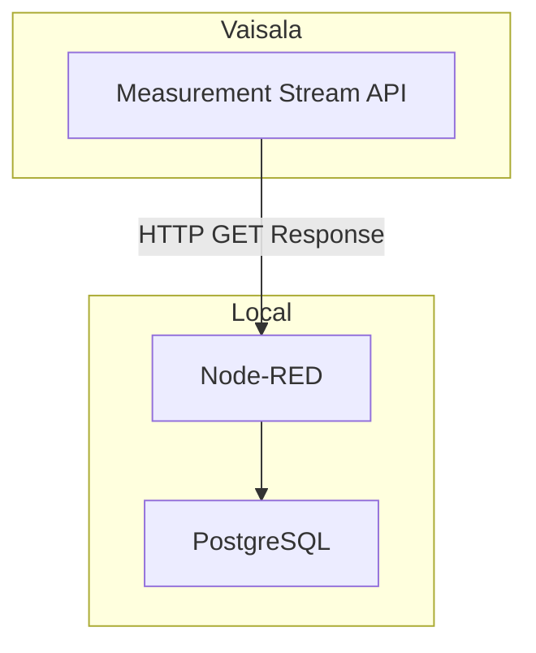

# Streaming sensor data into PostgreSQL

## Vaisala Stream API

## Google Cloud Stream

### References:
  + [Meassurement Stream API](https://api-catalog.eu.platform.xweather.com/docs/Measurement%20stream/stream-api)
  + [Undestanding Scopes Node Red](https://nodered.org/docs/user-guide/context)
  + [Google Sheets Doc](https://developers.google.com/apps-script/reference/spreadsheet/sheet)

